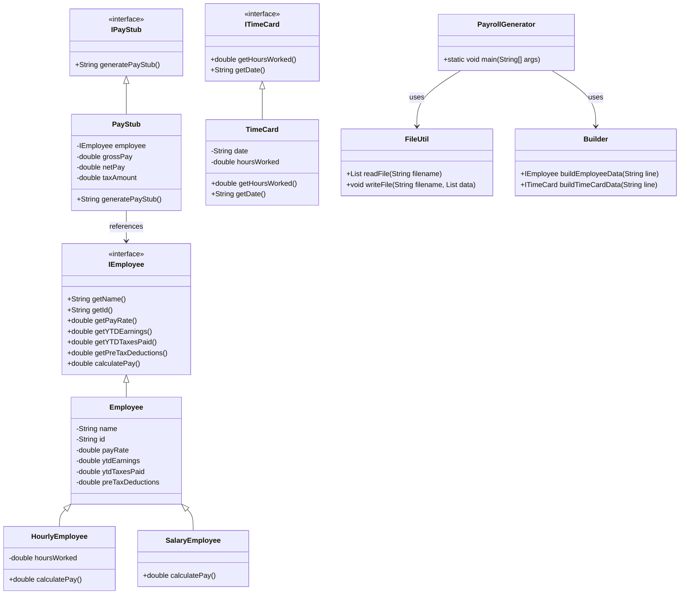

# Payroll Generator Design Document

This document is meant to provide a tool for you to demonstrate the design process. You need to work on this before you code, and after have a finished product. That way you can compare the changes, and changes in design are normal as you work through a project. It is contrary to popular belief, but we are not perfect our first attempt. We need to iterate on our designs to make them better. This document is a tool to help you do that.

## (INITIAL DESIGN): Class Diagram

Place your class diagram below. Make sure you check the fil in the browser on github.com to make sure it is rendering correctly. If it is not, you will need to fix it. As a reminder, here is a link to tools that can help you create a class diagram: [Class Resources: Class Design Tools](https://github.com/CS5004-khoury-lionelle/Resources?tab=readme-ov-file#uml-design-tools)

## (INITIAL DESIGN): Tests to Write - Brainstorm

Write a test (in english) that you can picture for the class diagram you have created. This is the brainstorming stage in the TDD process. 

> [!TIP]
> As a reminder, this is the TDD process we are following:
> 1. Figure out a number of tests by brainstorming (this step)
> 2. Write **one** test
> 3. Write **just enough** code to make that test pass
> 4. Refactor/update  as you go along
> 5. Repeat steps 2-4 until you have all the tests passing/fully built program

You should feel free to number your brainstorm. 

1. Test that the `Employee` class properly returns `name` from `getName()`
2. Test that the `Employee` class properly returns `id` from `getId()`
3. continue to add your brainstorm here (you don't need to super formal - this is a brainstorm) - yes, you can change the bullets above to something that fits your design.

Employee Tests:

Test 1: Verify that an HourlyEmployee returns the correct name when getName() is called.
Test 2: Verify that an HourlyEmployee returns the correct id when getId() is called.
Test 3: Verify that a SalaryEmployee returns the correct name using getName().
Test 4: Verify that a SalaryEmployee returns the correct id using getId().
Test 5: Check that the calculatePay() method of an HourlyEmployee returns the correct pay based on a set of input values (pay rate, hours worked, etc.).
Test 6: Check that the calculatePay() method of a SalaryEmployee returns the expected pay (perhaps considering deductions and taxes).

PayStub Tests:

Test 7: Verify that an object implementing IPayStub produces the correct pay stub output (string format, values, etc.) when generatePayStub() is called.
Test 8: Ensure that all necessary information (employee details, pay, deductions, etc.) appears correctly in the pay stub.

TimeCard Tests:

Test 9: For an implementation of ITimeCard, verify that it correctly returns the number of hours worked for a given day.
Test 10: Verify that the time card properly records and returns the date associated with the hours worked.

FileUtil Tests:

Test 11: Test that FileUtil.readFile() reads an existing CSV file correctly and returns the expected list of strings.
Test 12: Test that FileUtil.writeFile() creates/updates a file correctly when given valid data.
Test 13: Test error handling in FileUtil by attempting to read from a file that does not exist, ensuring it fails gracefully.

Builder Tests:

Test 14: Verify that Builder.buildEmployeeData(line) correctly parses a CSV line into an IEmployee object (for both HourlyEmployee and SalaryEmployee) with the right attribute values.
Test 15: Verify that Builder.buildTimeCardData(line) correctly parses a CSV line into an ITimeCard object.
Test 16: Test error cases in the Builder methods (e.g., missing fields, invalid numbers) to ensure that appropriate error handling or exceptions occur.

PayrollGenerator Tests:

Test 17: Simulate a full run of PayrollGenerator.main() using a test CSV file and verify that the program reads the file, processes the data, and produces the correct output.
Test 18: Check that PayrollGenerator handles empty or malformed CSV files without crashing (e.g., by logging errors and skipping bad records).

## (FINAL DESIGN): Class Diagram

Go through your completed code, and update your class diagram to reflect the final design. Make sure you check the file in the browser on github.com to make sure it is rendering correctly. It is normal that the two diagrams don't match! Rarely (though possible) is your initial design perfect. 

> [!WARNING]
> If you resubmit your assignment for manual grading, this is a section that often needs updating. You should double check with every resubmit to make sure it is up to date.

## (FINAL DESIGN): Reflection/Retrospective

> [!IMPORTANT]
> The value of reflective writing has been highly researched and documented within computer science, from learning new information to showing higher salaries in the workplace. For this next part, we encourage you to take time, and truly focus on your retrospective.

Take time to reflect on how your design has changed. Write in *prose* (i.e. do not bullet point your answers - it matters in how our brain processes the information). Make sure to include what were some major changes, and why you made them. What did you learn from this process? What would you do differently next time? What was the most challenging part of this process? For most students, it will be a paragraph or two. 
